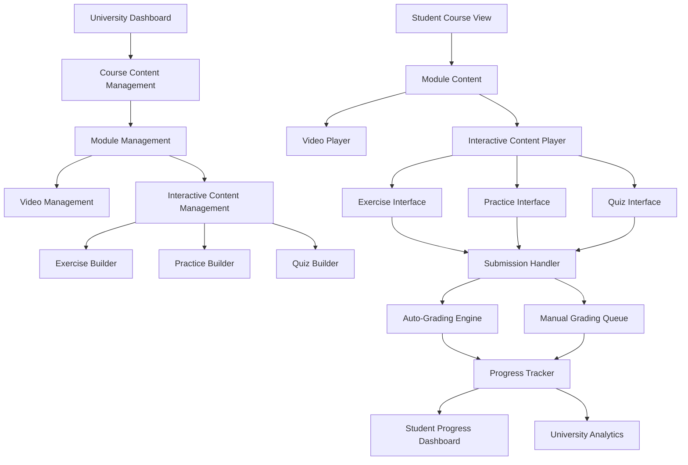
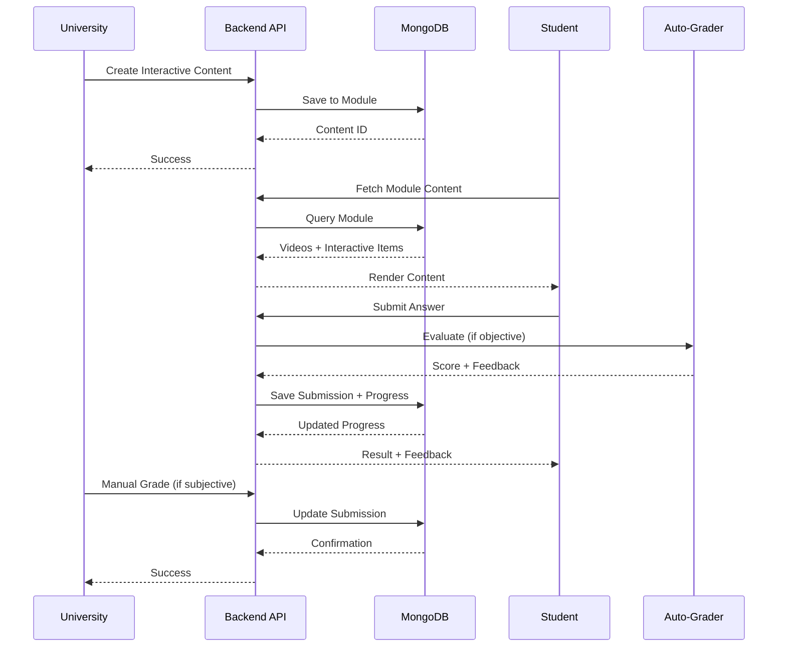

# Design Document: Course Interactive Content

## Overview

This feature extends the SkillDad course content management system to support interactive learning elements beyond videos. Universities will be able to add exercises, practice problems, and quizzes to course modules, enabling active learning and assessment. Students can complete these interactive elements, receive immediate feedback for objective questions, and track their progress. The system supports multiple question types (multiple choice, true/false, short answer, code submissions), auto-grading for objective questions, and manual grading workflows for subjective responses.

The design integrates seamlessly with the existing module-based course structure, where interactive content items are organized alongside videos within modules. Progress tracking extends the current Progress model to capture completion status, scores, and submission history for all interactive elements.

## Architecture



## Main Algorithm/Workflow




## Components and Interfaces

### Component 1: InteractiveContentManager (Backend)

**Purpose**: Manages CRUD operations for exercises, practice problems, and quizzes within course modules

**Interface**:
```typescript
interface InteractiveContentManager {
  createContent(moduleId: string, content: InteractiveContent): Promise<ContentResult>
  updateContent(contentId: string, updates: Partial<InteractiveContent>): Promise<ContentResult>
  deleteContent(moduleId: string, contentId: string): Promise<boolean>
  getModuleContent(moduleId: string): Promise<InteractiveContent[]>
  reorderContent(moduleId: string, contentIds: string[]): Promise<boolean>
}
```

**Responsibilities**:
- Validate content structure and question types
- Enforce university ownership permissions
- Maintain content ordering within modules
- Handle cascading deletes when modules are removed

### Component 2: SubmissionHandler (Backend)

**Purpose**: Processes student submissions for interactive content and routes to appropriate grading mechanism

**Interface**:
```typescript
interface SubmissionHandler {
  submitAnswer(userId: string, contentId: string, answer: Answer): Promise<SubmissionResult>
  getSubmission(submissionId: string): Promise<Submission>
  getUserSubmissions(userId: string, courseId: string): Promise<Submission[]>
  retrySubmission(submissionId: string, answer: Answer): Promise<SubmissionResult>
}
```

**Responsibilities**:
- Validate submission format and content
- Route objective questions to auto-grader
- Queue subjective answers for manual review
- Track submission attempts and timestamps
- Update progress records upon successful submission

### Component 3: AutoGrader (Backend)

**Purpose**: Automatically evaluates objective questions and provides immediate feedback

**Interface**:
```typescript
interface AutoGrader {
  gradeMultipleChoice(answer: string, correctAnswer: string): GradeResult
  gradeTrueFalse(answer: boolean, correctAnswer: boolean): GradeResult
  gradeShortAnswer(answer: string, acceptedAnswers: string[]): GradeResult
  calculateScore(results: GradeResult[]): number
}
```

**Responsibilities**:
- Compare student answers with correct answers
- Handle case-insensitive matching for text answers
- Calculate percentage scores
- Generate feedback messages
- Support partial credit for multi-part questions


### Component 4: ManualGradingQueue (Backend)

**Purpose**: Manages the queue of subjective submissions awaiting instructor review

**Interface**:
```typescript
interface ManualGradingQueue {
  getPendingSubmissions(courseId: string): Promise<Submission[]>
  gradeSubmission(submissionId: string, grade: Grade): Promise<boolean>
  addFeedback(submissionId: string, feedback: string): Promise<boolean>
  getSubmissionStats(courseId: string): Promise<GradingStats>
}
```

**Responsibilities**:
- Maintain queue of ungraded submissions
- Filter submissions by course and instructor
- Record grades and feedback from instructors
- Notify students when grades are available
- Track grading turnaround time

### Component 5: ProgressTracker (Backend)

**Purpose**: Updates and maintains student progress records for interactive content

**Interface**:
```typescript
interface ProgressTracker {
  recordCompletion(userId: string, contentId: string, score: number): Promise<Progress>
  getProgress(userId: string, courseId: string): Promise<Progress>
  calculateModuleProgress(userId: string, moduleId: string): Promise<number>
  calculateCourseProgress(userId: string, courseId: string): Promise<number>
}
```

**Responsibilities**:
- Track completed exercises, practices, and quizzes
- Store scores and attempt history
- Calculate completion percentages
- Update overall course progress
- Support progress analytics and reporting

### Component 6: InteractiveContentBuilder (Frontend)

**Purpose**: UI component for universities to create and edit interactive content

**Interface**:
```typescript
interface InteractiveContentBuilder {
  renderBuilder(contentType: ContentType): JSX.Element
  addQuestion(): void
  removeQuestion(index: number): void
  updateQuestion(index: number, question: Question): void
  saveContent(): Promise<void>
  previewContent(): void
}
```

**Responsibilities**:
- Provide intuitive form interfaces for each content type
- Support rich text editing for questions
- Enable adding/removing/reordering questions
- Validate input before submission
- Show preview of student-facing interface


### Component 7: InteractiveContentPlayer (Frontend)

**Purpose**: Student-facing interface for completing interactive content

**Interface**:
```typescript
interface InteractiveContentPlayer {
  renderContent(content: InteractiveContent): JSX.Element
  submitAnswer(answer: Answer): Promise<void>
  showFeedback(result: SubmissionResult): void
  revealSolution(): void
  retryQuestion(): void
}
```

**Responsibilities**:
- Render questions with appropriate input controls
- Capture and validate student answers
- Display immediate feedback for auto-graded items
- Show solutions for practice problems
- Handle retry attempts for exercises
- Update UI based on submission status

## Data Models

### Model 1: InteractiveContent (Base)

```typescript
interface InteractiveContent {
  _id: ObjectId
  type: 'exercise' | 'practice' | 'quiz'
  title: string
  description: string
  instructions: string
  timeLimit?: number  // in minutes, null for untimed
  attemptsAllowed: number  // -1 for unlimited
  passingScore?: number  // percentage, only for quizzes
  showSolutionAfter: 'immediate' | 'submission' | 'never'
  questions: Question[]
  createdAt: Date
  updatedAt: Date
}
```

**Validation Rules**:
- title must be non-empty and max 200 characters
- type must be one of the three allowed values
- attemptsAllowed must be -1 or positive integer
- passingScore must be between 0 and 100 if provided
- questions array must contain at least 1 question
- timeLimit must be positive if provided

### Model 2: Question

```typescript
interface Question {
  _id: ObjectId
  questionType: 'multiple-choice' | 'true-false' | 'short-answer' | 'code-submission' | 'essay'
  questionText: string
  points: number
  
  // For multiple-choice
  options?: string[]
  correctAnswer?: string | string[]  // single or multiple correct answers
  
  // For short-answer
  acceptedAnswers?: string[]  // case-insensitive matching
  
  // For code-submission
  language?: string
  starterCode?: string
  testCases?: TestCase[]
  
  // For essay
  maxWords?: number
  rubric?: string
  
  explanation?: string  // shown after submission
  hints?: string[]
}
```

**Validation Rules**:
- questionText must be non-empty
- points must be positive number
- options required for multiple-choice (min 2, max 10)
- correctAnswer required for objective types
- acceptedAnswers required for short-answer
- language required for code-submission
- maxWords must be positive if provided


### Model 3: Submission

```typescript
interface Submission {
  _id: ObjectId
  user: ObjectId  // ref: User
  course: ObjectId  // ref: Course
  module: ObjectId
  content: ObjectId  // ref: InteractiveContent
  contentType: 'exercise' | 'practice' | 'quiz'
  
  answers: Answer[]
  score: number  // percentage
  maxScore: number
  isPassing: boolean
  
  status: 'pending' | 'graded' | 'needs-review'
  gradedBy?: ObjectId  // ref: User (instructor)
  gradedAt?: Date
  feedback?: string
  
  attemptNumber: number
  startedAt: Date
  submittedAt: Date
  timeSpent: number  // in seconds
  
  createdAt: Date
  updatedAt: Date
}
```

**Validation Rules**:
- user, course, module, content are required references
- answers array must match number of questions
- score must be between 0 and 100
- status must be one of allowed values
- attemptNumber must be positive integer
- submittedAt must be after startedAt
- timeSpent must be non-negative

### Model 4: Answer

```typescript
interface Answer {
  questionId: ObjectId
  answerValue: string | string[] | CodeSubmission
  isCorrect?: boolean  // null for subjective questions
  pointsEarned: number
  feedback?: string
  gradedAt?: Date
}
```

**Validation Rules**:
- questionId must reference valid question
- answerValue must be non-empty
- pointsEarned must be non-negative
- pointsEarned cannot exceed question points

### Model 5: CodeSubmission

```typescript
interface CodeSubmission {
  code: string
  language: string
  testResults?: TestResult[]
  executionTime?: number
  memoryUsed?: number
}
```

**Validation Rules**:
- code must be non-empty
- language must match question's specified language
- executionTime and memoryUsed must be non-negative if provided

### Model 6: TestCase

```typescript
interface TestCase {
  input: string
  expectedOutput: string
  isHidden: boolean  // hidden test cases not shown to students
  points: number
}
```

**Validation Rules**:
- input and expectedOutput are required
- points must be positive


### Model 7: Updated Module Schema

```typescript
interface Module {
  _id: ObjectId
  title: string
  videos: Video[]
  interactiveContent: InteractiveContent[]  // NEW FIELD
  order: number
}
```

**Validation Rules**:
- interactiveContent items must maintain unique IDs within module
- order field determines display sequence

### Model 8: Updated Progress Schema

```typescript
interface Progress {
  user: ObjectId
  course: ObjectId
  completedVideos: ObjectId[]
  completedExercises: ExerciseProgress[]  // UPDATED
  completedPractices: ObjectId[]  // NEW
  completedQuizzes: QuizProgress[]  // NEW
  projectSubmissions: ProjectSubmission[]
  isCompleted: boolean
  createdAt: Date
  updatedAt: Date
}

interface ExerciseProgress {
  content: ObjectId
  attempts: number
  bestScore: number
  lastAttemptAt: Date
  isCompleted: boolean
}

interface QuizProgress {
  content: ObjectId
  attempts: number
  bestScore: number
  isPassing: boolean
  lastAttemptAt: Date
}
```

**Validation Rules**:
- bestScore must be between 0 and 100
- attempts must be positive integer
- lastAttemptAt must be valid date
- isCompleted for exercises when score meets threshold
- isPassing for quizzes when score >= passingScore

## Key Functions with Formal Specifications

### Function 1: createInteractiveContent()

```typescript
function createInteractiveContent(
  courseId: string,
  moduleId: string,
  content: InteractiveContent,
  userId: string
): Promise<ContentResult>
```

**Preconditions:**
- `courseId` is valid ObjectId and course exists
- `moduleId` is valid ObjectId and belongs to course
- `userId` is valid ObjectId with 'university' role
- User owns the course (course.instructor === userId)
- `content` object is well-formed and passes validation
- `content.questions` array is non-empty
- All questions have valid questionType values

**Postconditions:**
- Returns ContentResult with success status and content ID
- New InteractiveContent document created in database
- Content added to module's interactiveContent array
- Content._id is unique within the module
- createdAt and updatedAt timestamps are set
- If error: returns error message, no database changes

**Loop Invariants:** N/A


### Function 2: submitAnswer()

```typescript
function submitAnswer(
  userId: string,
  contentId: string,
  answers: Answer[],
  startTime: Date
): Promise<SubmissionResult>
```

**Preconditions:**
- `userId` is valid ObjectId and user exists with 'student' role
- `contentId` is valid ObjectId and content exists
- User is enrolled in the course containing the content
- `answers` array length matches content.questions length
- Each answer has valid questionId matching a question
- `startTime` is valid Date and not in future
- User has not exceeded attemptsAllowed (if limited)
- If timed: submission within timeLimit

**Postconditions:**
- Returns SubmissionResult with score, feedback, and submission ID
- New Submission document created in database
- Objective questions are auto-graded with isCorrect and pointsEarned set
- Subjective questions have status='needs-review'
- Progress record updated with new submission
- attemptNumber incremented correctly
- timeSpent calculated as (submittedAt - startTime)
- If quiz: isPassing flag set based on passingScore
- If error: returns error message, no database changes

**Loop Invariants:**
- For answer grading loop: All previously graded answers have valid scores
- Total pointsEarned never exceeds maxScore

### Function 3: gradeObjectiveQuestion()

```typescript
function gradeObjectiveQuestion(
  question: Question,
  answer: Answer
): GradeResult
```

**Preconditions:**
- `question` is non-null and has objective questionType
- `question.correctAnswer` is defined and non-empty
- `answer.answerValue` is defined
- questionType is one of: 'multiple-choice', 'true-false', 'short-answer'

**Postconditions:**
- Returns GradeResult with isCorrect boolean and pointsEarned
- For multiple-choice: exact match with correctAnswer (case-sensitive)
- For true-false: boolean comparison
- For short-answer: case-insensitive match against acceptedAnswers array
- pointsEarned = question.points if correct, 0 if incorrect
- feedback string generated based on correctness
- No side effects on input parameters

**Loop Invariants:**
- For short-answer checking: All previously checked accepted answers remain valid


### Function 4: manualGradeSubmission()

```typescript
function manualGradeSubmission(
  submissionId: string,
  questionId: string,
  pointsEarned: number,
  feedback: string,
  instructorId: string
): Promise<boolean>
```

**Preconditions:**
- `submissionId` is valid ObjectId and submission exists
- `questionId` is valid ObjectId and belongs to submission
- `instructorId` is valid ObjectId with 'university' role
- Instructor owns the course containing the submission
- `pointsEarned` is non-negative number
- `pointsEarned` <= question.points
- Question is subjective type ('code-submission' or 'essay')

**Postconditions:**
- Returns true on success, false on error
- Answer.pointsEarned updated with provided value
- Answer.feedback updated with provided text
- Answer.gradedAt set to current timestamp
- If all questions graded: submission.status = 'graded'
- submission.gradedBy set to instructorId
- submission.score recalculated based on all answers
- Progress record updated with new score
- Student notified of grade availability
- No changes if validation fails

**Loop Invariants:** N/A

### Function 5: calculateProgress()

```typescript
function calculateProgress(
  userId: string,
  courseId: string
): Promise<ProgressSummary>
```

**Preconditions:**
- `userId` is valid ObjectId and user exists
- `courseId` is valid ObjectId and course exists
- User is enrolled in the course
- Progress record exists for user-course pair

**Postconditions:**
- Returns ProgressSummary with completion percentages
- Videos completion: (completedVideos.length / totalVideos) * 100
- Exercises completion: (completedExercises.length / totalExercises) * 100
- Practices completion: (completedPractices.length / totalPractices) * 100
- Quizzes completion: (passedQuizzes.length / totalQuizzes) * 100
- Overall completion: weighted average of all categories
- All percentages between 0 and 100
- No side effects on database

**Loop Invariants:**
- For module iteration: All previously calculated module percentages are valid
- Running total never exceeds 100%


## Algorithmic Pseudocode

### Main Processing Algorithm: Submit and Grade Interactive Content

```pascal
ALGORITHM submitAndGradeContent(userId, contentId, answers, startTime)
INPUT: userId (ObjectId), contentId (ObjectId), answers (Answer[]), startTime (Date)
OUTPUT: result (SubmissionResult)

BEGIN
  ASSERT userIsEnrolled(userId, contentId.courseId) = true
  ASSERT answers.length = content.questions.length
  
  // Step 1: Validate attempt limits
  attemptCount ← getAttemptCount(userId, contentId)
  content ← fetchContent(contentId)
  
  IF content.attemptsAllowed ≠ -1 AND attemptCount ≥ content.attemptsAllowed THEN
    RETURN Error("Maximum attempts exceeded")
  END IF
  
  // Step 2: Validate time limit
  currentTime ← getCurrentTime()
  timeSpent ← currentTime - startTime
  
  IF content.timeLimit ≠ null AND timeSpent > content.timeLimit * 60 THEN
    RETURN Error("Time limit exceeded")
  END IF
  
  // Step 3: Grade each answer with loop invariant
  totalPoints ← 0
  maxPoints ← 0
  gradedAnswers ← []
  
  FOR each question, answer IN zip(content.questions, answers) DO
    ASSERT totalPoints ≤ maxPoints  // Loop invariant
    
    maxPoints ← maxPoints + question.points
    
    IF isObjectiveQuestion(question.questionType) THEN
      gradeResult ← gradeObjectiveQuestion(question, answer)
      answer.isCorrect ← gradeResult.isCorrect
      answer.pointsEarned ← gradeResult.pointsEarned
      answer.feedback ← gradeResult.feedback
      answer.gradedAt ← currentTime
      totalPoints ← totalPoints + gradeResult.pointsEarned
    ELSE
      // Subjective question - queue for manual grading
      answer.isCorrect ← null
      answer.pointsEarned ← 0
      answer.feedback ← "Pending instructor review"
      answer.gradedAt ← null
    END IF
    
    gradedAnswers.add(answer)
  END FOR
  
  ASSERT totalPoints ≤ maxPoints  // Final invariant check
  
  // Step 4: Calculate score and status
  scorePercentage ← (totalPoints / maxPoints) * 100
  hasSubjective ← containsSubjectiveQuestions(content.questions)
  
  IF hasSubjective THEN
    status ← "needs-review"
  ELSE
    status ← "graded"
  END IF
  
  isPassing ← false
  IF content.type = "quiz" AND content.passingScore ≠ null THEN
    isPassing ← scorePercentage ≥ content.passingScore
  END IF
  
  // Step 5: Create submission record
  submission ← createSubmission({
    user: userId,
    content: contentId,
    answers: gradedAnswers,
    score: scorePercentage,
    maxScore: maxPoints,
    status: status,
    isPassing: isPassing,
    attemptNumber: attemptCount + 1,
    startedAt: startTime,
    submittedAt: currentTime,
    timeSpent: timeSpent
  })
  
  // Step 6: Update progress
  updateProgress(userId, contentId, scorePercentage, isPassing)
  
  ASSERT submission.score ≥ 0 AND submission.score ≤ 100
  
  RETURN SubmissionResult(submission.id, scorePercentage, isPassing, gradedAnswers)
END
```

**Preconditions:**
- User is enrolled in course containing the content
- answers array matches questions array length
- startTime is valid and not in future
- User has not exceeded attempt limits

**Postconditions:**
- Submission record created with all answers graded or queued
- Progress record updated with new attempt
- Score calculated correctly as percentage
- Objective questions have immediate feedback
- Subjective questions marked for review

**Loop Invariants:**
- totalPoints never exceeds maxPoints during grading iteration
- All previously graded answers have valid scores
- gradedAnswers array length equals processed questions count


### Objective Question Grading Algorithm

```pascal
ALGORITHM gradeObjectiveQuestion(question, answer)
INPUT: question (Question), answer (Answer)
OUTPUT: result (GradeResult)

BEGIN
  ASSERT question.questionType IN ['multiple-choice', 'true-false', 'short-answer']
  ASSERT question.correctAnswer ≠ null
  
  isCorrect ← false
  pointsEarned ← 0
  feedback ← ""
  
  // Branch based on question type
  IF question.questionType = 'multiple-choice' THEN
    // Exact match (case-sensitive)
    IF answer.answerValue = question.correctAnswer THEN
      isCorrect ← true
      pointsEarned ← question.points
      feedback ← "Correct!"
    ELSE
      isCorrect ← false
      pointsEarned ← 0
      feedback ← "Incorrect. " + question.explanation
    END IF
    
  ELSE IF question.questionType = 'true-false' THEN
    // Boolean comparison
    IF answer.answerValue = question.correctAnswer THEN
      isCorrect ← true
      pointsEarned ← question.points
      feedback ← "Correct!"
    ELSE
      isCorrect ← false
      pointsEarned ← 0
      feedback ← "Incorrect. " + question.explanation
    END IF
    
  ELSE IF question.questionType = 'short-answer' THEN
    // Case-insensitive matching against accepted answers
    normalizedAnswer ← toLowerCase(trim(answer.answerValue))
    
    FOR each acceptedAnswer IN question.acceptedAnswers DO
      normalizedAccepted ← toLowerCase(trim(acceptedAnswer))
      
      IF normalizedAnswer = normalizedAccepted THEN
        isCorrect ← true
        pointsEarned ← question.points
        feedback ← "Correct!"
        BREAK
      END IF
    END FOR
    
    IF NOT isCorrect THEN
      feedback ← "Incorrect. " + question.explanation
    END IF
  END IF
  
  ASSERT pointsEarned ≥ 0 AND pointsEarned ≤ question.points
  
  RETURN GradeResult(isCorrect, pointsEarned, feedback)
END
```

**Preconditions:**
- question has objective questionType
- question.correctAnswer is defined
- For short-answer: question.acceptedAnswers is non-empty array
- answer.answerValue is provided

**Postconditions:**
- Returns GradeResult with valid isCorrect boolean
- pointsEarned is either 0 or question.points (no partial credit)
- feedback string is non-empty
- No mutations to input parameters

**Loop Invariants:**
- For short-answer loop: All previously checked answers remain valid
- isCorrect remains false until match found


### Progress Calculation Algorithm

```pascal
ALGORITHM calculateCourseProgress(userId, courseId)
INPUT: userId (ObjectId), courseId (ObjectId)
OUTPUT: summary (ProgressSummary)

BEGIN
  ASSERT userIsEnrolled(userId, courseId) = true
  
  // Step 1: Fetch course structure and progress
  course ← fetchCourse(courseId)
  progress ← fetchProgress(userId, courseId)
  
  // Step 2: Count total items
  totalVideos ← 0
  totalExercises ← 0
  totalPractices ← 0
  totalQuizzes ← 0
  
  FOR each module IN course.modules DO
    totalVideos ← totalVideos + module.videos.length
    
    FOR each content IN module.interactiveContent DO
      IF content.type = 'exercise' THEN
        totalExercises ← totalExercises + 1
      ELSE IF content.type = 'practice' THEN
        totalPractices ← totalPractices + 1
      ELSE IF content.type = 'quiz' THEN
        totalQuizzes ← totalQuizzes + 1
      END IF
    END FOR
  END FOR
  
  // Step 3: Calculate completion percentages
  videoProgress ← 0
  IF totalVideos > 0 THEN
    videoProgress ← (progress.completedVideos.length / totalVideos) * 100
  END IF
  
  exerciseProgress ← 0
  IF totalExercises > 0 THEN
    completedExercises ← countCompleted(progress.completedExercises)
    exerciseProgress ← (completedExercises / totalExercises) * 100
  END IF
  
  practiceProgress ← 0
  IF totalPractices > 0 THEN
    practiceProgress ← (progress.completedPractices.length / totalPractices) * 100
  END IF
  
  quizProgress ← 0
  IF totalQuizzes > 0 THEN
    passedQuizzes ← countPassing(progress.completedQuizzes)
    quizProgress ← (passedQuizzes / totalQuizzes) * 100
  END IF
  
  // Step 4: Calculate weighted overall progress
  // Weights: Videos 40%, Exercises 20%, Practices 15%, Quizzes 25%
  overallProgress ← (videoProgress * 0.4) + 
                    (exerciseProgress * 0.2) + 
                    (practiceProgress * 0.15) + 
                    (quizProgress * 0.25)
  
  ASSERT overallProgress ≥ 0 AND overallProgress ≤ 100
  ASSERT videoProgress ≥ 0 AND videoProgress ≤ 100
  ASSERT exerciseProgress ≥ 0 AND exerciseProgress ≤ 100
  ASSERT practiceProgress ≥ 0 AND practiceProgress ≤ 100
  ASSERT quizProgress ≥ 0 AND quizProgress ≤ 100
  
  RETURN ProgressSummary({
    overall: overallProgress,
    videos: videoProgress,
    exercises: exerciseProgress,
    practices: practiceProgress,
    quizzes: quizProgress,
    totalItems: totalVideos + totalExercises + totalPractices + totalQuizzes,
    completedItems: progress.completedVideos.length + 
                    completedExercises + 
                    progress.completedPractices.length + 
                    passedQuizzes
  })
END
```

**Preconditions:**
- User is enrolled in the course
- Progress record exists for user-course pair
- Course has valid module structure

**Postconditions:**
- Returns ProgressSummary with all percentages between 0 and 100
- Weighted overall progress calculated correctly
- Individual category percentages accurate
- No side effects on database

**Loop Invariants:**
- For module counting loop: All previously counted totals are non-negative
- Running totals never decrease during iteration


### Manual Grading Algorithm

```pascal
ALGORITHM manualGradeSubmission(submissionId, questionId, pointsEarned, feedback, instructorId)
INPUT: submissionId (ObjectId), questionId (ObjectId), pointsEarned (number), 
       feedback (string), instructorId (ObjectId)
OUTPUT: success (boolean)

BEGIN
  ASSERT instructorOwnsSubmission(instructorId, submissionId) = true
  
  // Step 1: Fetch submission and validate
  submission ← fetchSubmission(submissionId)
  question ← findQuestion(submission.content, questionId)
  
  ASSERT question ≠ null
  ASSERT isSubjectiveQuestion(question.questionType) = true
  ASSERT pointsEarned ≥ 0 AND pointsEarned ≤ question.points
  
  // Step 2: Update answer with grade
  answer ← findAnswer(submission.answers, questionId)
  answer.pointsEarned ← pointsEarned
  answer.feedback ← feedback
  answer.gradedAt ← getCurrentTime()
  answer.isCorrect ← (pointsEarned = question.points)
  
  // Step 3: Check if all questions are graded
  allGraded ← true
  totalPoints ← 0
  maxPoints ← 0
  
  FOR each ans IN submission.answers DO
    maxPoints ← maxPoints + getQuestionPoints(ans.questionId)
    
    IF ans.gradedAt = null THEN
      allGraded ← false
    ELSE
      totalPoints ← totalPoints + ans.pointsEarned
    END IF
  END FOR
  
  // Step 4: Update submission status and score
  IF allGraded THEN
    submission.status ← "graded"
    submission.score ← (totalPoints / maxPoints) * 100
    submission.gradedBy ← instructorId
    submission.gradedAt ← getCurrentTime()
    
    // Update isPassing for quizzes
    IF submission.contentType = "quiz" THEN
      content ← fetchContent(submission.content)
      IF content.passingScore ≠ null THEN
        submission.isPassing ← submission.score ≥ content.passingScore
      END IF
    END IF
    
    // Update progress record
    updateProgress(submission.user, submission.content, submission.score, submission.isPassing)
    
    // Notify student
    notifyStudent(submission.user, submissionId)
  END IF
  
  // Step 5: Save changes
  saveSubmission(submission)
  
  ASSERT submission.score ≥ 0 AND submission.score ≤ 100
  
  RETURN true
END
```

**Preconditions:**
- Instructor owns the course containing the submission
- Question is subjective type (code-submission or essay)
- pointsEarned is within valid range [0, question.points]
- Submission exists and is in valid state

**Postconditions:**
- Answer updated with grade, feedback, and timestamp
- If all questions graded: submission status changed to 'graded'
- Submission score recalculated based on all answers
- Progress record updated with final score
- Student notified when grading complete
- No changes if validation fails

**Loop Invariants:**
- For grading check loop: totalPoints never exceeds maxPoints
- All previously checked answers maintain their graded status


## Example Usage

### Example 1: University Creates Exercise

```typescript
// University creates a new exercise for a module
const exercise = {
  type: 'exercise',
  title: 'JavaScript Array Methods',
  description: 'Practice using map, filter, and reduce',
  instructions: 'Answer the following questions about array methods',
  attemptsAllowed: 3,
  showSolutionAfter: 'submission',
  questions: [
    {
      questionType: 'multiple-choice',
      questionText: 'Which method creates a new array with transformed elements?',
      points: 10,
      options: ['map()', 'filter()', 'reduce()', 'forEach()'],
      correctAnswer: 'map()',
      explanation: 'map() transforms each element and returns a new array'
    },
    {
      questionType: 'short-answer',
      questionText: 'What does filter() return?',
      points: 10,
      acceptedAnswers: ['new array', 'a new array', 'array'],
      explanation: 'filter() returns a new array with elements that pass the test'
    }
  ]
}

const result = await createInteractiveContent(courseId, moduleId, exercise, universityId)
// Returns: { success: true, contentId: '507f1f77bcf86cd799439011' }
```

### Example 2: Student Submits Exercise

```typescript
// Student completes the exercise
const answers = [
  {
    questionId: '507f1f77bcf86cd799439012',
    answerValue: 'map()'
  },
  {
    questionId: '507f1f77bcf86cd799439013',
    answerValue: 'new array'
  }
]

const startTime = new Date('2024-01-15T10:00:00Z')
const result = await submitAnswer(studentId, contentId, answers, startTime)

// Returns: {
//   submissionId: '507f1f77bcf86cd799439014',
//   score: 100,
//   isPassing: true,
//   answers: [
//     { questionId: '...', isCorrect: true, pointsEarned: 10, feedback: 'Correct!' },
//     { questionId: '...', isCorrect: true, pointsEarned: 10, feedback: 'Correct!' }
//   ]
// }
```


### Example 3: University Creates Quiz with Passing Score

```typescript
// University creates a quiz with time limit and passing score
const quiz = {
  type: 'quiz',
  title: 'Module 1 Assessment',
  description: 'Test your understanding of JavaScript fundamentals',
  instructions: 'You have 30 minutes to complete this quiz. Passing score is 70%.',
  timeLimit: 30,
  attemptsAllowed: 2,
  passingScore: 70,
  showSolutionAfter: 'never',
  questions: [
    {
      questionType: 'multiple-choice',
      questionText: 'What is the output of typeof null?',
      points: 25,
      options: ['null', 'object', 'undefined', 'number'],
      correctAnswer: 'object',
      explanation: 'typeof null returns "object" due to a historical bug in JavaScript'
    },
    {
      questionType: 'true-false',
      questionText: 'JavaScript is a statically typed language',
      points: 25,
      correctAnswer: false,
      explanation: 'JavaScript is dynamically typed'
    },
    {
      questionType: 'code-submission',
      questionText: 'Write a function that reverses a string',
      points: 50,
      language: 'javascript',
      starterCode: 'function reverseString(str) {\n  // Your code here\n}',
      testCases: [
        { input: 'hello', expectedOutput: 'olleh', isHidden: false, points: 25 },
        { input: 'world', expectedOutput: 'dlrow', isHidden: true, points: 25 }
      ]
    }
  ]
}

const result = await createInteractiveContent(courseId, moduleId, quiz, universityId)
```

### Example 4: Manual Grading of Code Submission

```typescript
// Instructor grades a code submission
const submissionId = '507f1f77bcf86cd799439015'
const questionId = '507f1f77bcf86cd799439016'
const pointsEarned = 45  // Out of 50 possible
const feedback = 'Good solution! Minor optimization: you could use split().reverse().join() for cleaner code.'

const success = await manualGradeSubmission(
  submissionId,
  questionId,
  pointsEarned,
  feedback,
  instructorId
)

// Returns: true
// Student receives notification and can view feedback
```

### Example 5: Calculate Student Progress

```typescript
// Get comprehensive progress for a student
const progress = await calculateProgress(studentId, courseId)

// Returns: {
//   overall: 67.5,
//   videos: 80,
//   exercises: 75,
//   practices: 60,
//   quizzes: 50,
//   totalItems: 45,
//   completedItems: 30
// }
```


## Correctness Properties

### Property 1: Score Bounds
∀ submission ∈ Submissions: 0 ≤ submission.score ≤ 100

### Property 2: Points Earned Never Exceeds Maximum
∀ submission ∈ Submissions: Σ(answer.pointsEarned) ≤ Σ(question.points)

### Property 3: Attempt Limit Enforcement
∀ user, content: content.attemptsAllowed ≠ -1 ⟹ 
  count(submissions where user=user ∧ content=content) ≤ content.attemptsAllowed

### Property 4: Time Limit Enforcement
∀ submission ∈ Submissions: submission.content.timeLimit ≠ null ⟹ 
  submission.timeSpent ≤ submission.content.timeLimit * 60

### Property 5: Objective Questions Auto-Graded
∀ answer ∈ submission.answers: isObjective(answer.question.type) ⟹ 
  answer.isCorrect ≠ null ∧ answer.gradedAt ≠ null

### Property 6: Subjective Questions Require Manual Grading
∀ answer ∈ submission.answers: isSubjective(answer.question.type) ⟹ 
  answer.isCorrect = null ∨ answer.gradedBy ≠ null

### Property 7: Quiz Passing Status Consistency
∀ submission ∈ Submissions: submission.contentType = 'quiz' ∧ 
  submission.content.passingScore ≠ null ⟹ 
  submission.isPassing = (submission.score ≥ submission.content.passingScore)

### Property 8: Progress Monotonicity
∀ user, course: newSubmission(user, course) ⟹ 
  progress.completedItems(after) ≥ progress.completedItems(before)

### Property 9: Answer Count Matches Question Count
∀ submission ∈ Submissions: 
  submission.answers.length = submission.content.questions.length

### Property 10: Enrollment Requirement
∀ submission ∈ Submissions: 
  ∃ enrollment: enrollment.user = submission.user ∧ 
  enrollment.course = submission.course

### Property 11: Ownership Validation
∀ content ∈ InteractiveContent: 
  content.module.course.instructor = authenticated_user (for create/update/delete)

### Property 12: Grading Completeness
∀ submission ∈ Submissions: submission.status = 'graded' ⟹ 
  ∀ answer ∈ submission.answers: answer.gradedAt ≠ null


## Error Handling

### Error Scenario 1: Attempt Limit Exceeded

**Condition**: Student tries to submit when they've already used all allowed attempts
**Response**: Return 403 Forbidden with error message "Maximum attempts exceeded for this content"
**Recovery**: Student can view previous submissions but cannot create new ones; instructor can reset attempts if needed

### Error Scenario 2: Time Limit Exceeded

**Condition**: Student submits after the time limit has expired
**Response**: Return 400 Bad Request with error message "Time limit exceeded. Submission not accepted."
**Recovery**: Submission is rejected; student can retry if attempts remain; timer resets for new attempt

### Error Scenario 3: Unenrolled Student Access

**Condition**: Student attempts to access or submit content for a course they're not enrolled in
**Response**: Return 403 Forbidden with error message "You must be enrolled in this course"
**Recovery**: Redirect to course enrollment page; no data changes occur

### Error Scenario 4: Invalid Answer Format

**Condition**: Submitted answers don't match expected format or question count
**Response**: Return 400 Bad Request with detailed validation errors
**Recovery**: Client validates input before submission; server returns specific field errors for correction

### Error Scenario 5: Unauthorized Content Modification

**Condition**: Non-owner university tries to edit/delete content
**Response**: Return 403 Forbidden with error message "You don't have permission to modify this content"
**Recovery**: No changes applied; audit log records unauthorized attempt

### Error Scenario 6: Grading Non-Existent Submission

**Condition**: Instructor attempts to grade a submission that doesn't exist
**Response**: Return 404 Not Found with error message "Submission not found"
**Recovery**: Refresh submission list; verify submission ID

### Error Scenario 7: Invalid Points Assignment

**Condition**: Instructor assigns points outside valid range [0, question.points]
**Response**: Return 400 Bad Request with error message "Points must be between 0 and {question.points}"
**Recovery**: Client validates input; server rejects invalid values; no database changes

### Error Scenario 8: Concurrent Submission Conflict

**Condition**: Student submits while another submission is being processed
**Response**: Use optimistic locking; return 409 Conflict if race condition detected
**Recovery**: Retry submission after brief delay; show user-friendly message

### Error Scenario 9: Missing Required Fields

**Condition**: Content creation with incomplete question data
**Response**: Return 400 Bad Request with list of missing required fields
**Recovery**: Client-side validation prevents submission; server validation provides detailed feedback

### Error Scenario 10: Database Connection Failure

**Condition**: Database unavailable during submission or grading
**Response**: Return 503 Service Unavailable with retry-after header
**Recovery**: Implement exponential backoff retry logic; queue submissions for processing when service recovers


## Testing Strategy

### Unit Testing Approach

Test individual functions and components in isolation with comprehensive coverage of edge cases and error conditions.

**Key Test Cases**:

1. **Content Creation Tests**
   - Valid content creation for each type (exercise, practice, quiz)
   - Validation of required fields
   - Rejection of invalid question types
   - Ownership verification
   - Duplicate content ID prevention

2. **Grading Logic Tests**
   - Multiple choice exact matching
   - True/false boolean comparison
   - Short answer case-insensitive matching
   - Points calculation accuracy
   - Feedback generation
   - Edge cases: empty answers, special characters, whitespace

3. **Submission Tests**
   - Attempt limit enforcement
   - Time limit validation
   - Answer count validation
   - Status transitions (pending → graded)
   - Score calculation
   - Progress updates

4. **Progress Calculation Tests**
   - Empty progress (0%)
   - Partial completion
   - Full completion (100%)
   - Weighted average calculation
   - Edge case: no content items

5. **Manual Grading Tests**
   - Valid grade assignment
   - Points range validation
   - Feedback storage
   - Status updates when all questions graded
   - Notification triggering

**Coverage Goals**: Minimum 85% code coverage with focus on critical paths (grading, submission, progress)


### Property-Based Testing Approach

Use property-based testing to verify correctness properties hold across wide range of inputs.

**Property Test Library**: fast-check (for JavaScript/TypeScript)

**Key Properties to Test**:

1. **Score Bounds Property**
   - Generate random submissions with varying answers
   - Verify: 0 ≤ score ≤ 100 for all cases
   - Test with: empty answers, all correct, all incorrect, mixed

2. **Points Conservation Property**
   - Generate random questions with point values
   - Generate random correct/incorrect answers
   - Verify: total points earned ≤ total possible points
   - Test with: various question counts, point distributions

3. **Idempotent Grading Property**
   - Generate random objective questions and answers
   - Grade the same answer multiple times
   - Verify: result is identical each time
   - Test with: all question types, edge case answers

4. **Progress Monotonicity Property**
   - Generate sequence of submissions
   - Verify: progress never decreases
   - Test with: various completion orders, retry attempts

5. **Time Limit Enforcement Property**
   - Generate random time limits and submission times
   - Verify: submissions beyond limit are rejected
   - Test with: boundary values, negative times, very large values

6. **Attempt Limit Property**
   - Generate random attempt limits
   - Simulate multiple submissions
   - Verify: submissions stop at limit
   - Test with: -1 (unlimited), 0, 1, large numbers

**Test Execution**: Run 1000+ random test cases per property to ensure robustness


### Integration Testing Approach

Test complete workflows across multiple components and database interactions.

**Key Integration Tests**:

1. **End-to-End Content Creation Flow**
   - University creates content → saves to database → retrieves content
   - Verify: data persistence, ID generation, timestamps
   - Test with: all content types, various question configurations

2. **Student Submission Flow**
   - Student fetches content → submits answers → receives results → progress updated
   - Verify: auto-grading, database updates, response format
   - Test with: objective questions, mixed types, edge cases

3. **Manual Grading Workflow**
   - Student submits subjective answer → instructor grades → student notified
   - Verify: queue management, grade persistence, notification delivery
   - Test with: partial grading, complete grading, multiple instructors

4. **Progress Tracking Integration**
   - Multiple submissions across different content types
   - Verify: accurate progress calculation, proper aggregation
   - Test with: various completion patterns, retry attempts

5. **Authentication and Authorization Flow**
   - Test role-based access control
   - Verify: university can create, student can submit, proper rejection of unauthorized access
   - Test with: all user roles, cross-course access attempts

6. **Concurrent Access Scenarios**
   - Multiple students submitting simultaneously
   - Instructor grading while student submits
   - Verify: data consistency, no race conditions, proper locking

**Test Environment**: Use test database with seeded data; clean up after each test suite


## Performance Considerations

### Database Query Optimization

- **Indexing Strategy**: Create compound indexes on frequently queried fields
  - `submissions`: (user, course), (content, attemptNumber), (status, course)
  - `progress`: (user, course) - unique compound index
  - `interactiveContent`: (module, type)
- **Query Patterns**: Use projection to fetch only required fields; avoid loading full question arrays when only metadata needed
- **Aggregation Pipelines**: Use MongoDB aggregation for progress calculations to reduce data transfer

### Caching Strategy

- **Content Caching**: Cache interactive content for 5 minutes (Redis) since it changes infrequently
- **Progress Caching**: Cache user progress for 1 minute to reduce database load on repeated requests
- **Invalidation**: Clear cache on content updates, new submissions, or manual grading
- **Cache Keys**: `content:{contentId}`, `progress:{userId}:{courseId}`

### Submission Processing

- **Async Grading**: Process subjective question grading asynchronously using job queue (Bull/BullMQ)
- **Batch Updates**: Batch progress updates when processing multiple submissions
- **Rate Limiting**: Limit submission rate to 10 per minute per user to prevent abuse

### Frontend Optimization

- **Lazy Loading**: Load questions progressively for long quizzes
- **Debouncing**: Debounce auto-save for draft answers (2 second delay)
- **Pagination**: Paginate submission history (20 items per page)
- **Code Editor**: Use lightweight editor (CodeMirror) with syntax highlighting only for active language

### Scalability Targets

- Support 1000+ concurrent students taking quizzes
- Handle 100+ submissions per second during peak times
- Keep response time under 200ms for content retrieval
- Process auto-grading within 500ms
- Manual grading queue should handle 10,000+ pending submissions


## Security Considerations

### Authentication and Authorization

- **Role-Based Access Control (RBAC)**:
  - Universities: Create, update, delete content for their courses only
  - Students: Submit answers only for courses they're enrolled in
  - Instructors: Grade submissions only for their courses
- **JWT Token Validation**: Verify token on every request; check expiration and signature
- **Ownership Verification**: Always verify course ownership before content modifications
- **Enrollment Checks**: Validate enrollment status before allowing submissions

### Input Validation and Sanitization

- **Server-Side Validation**: Never trust client input; validate all fields against schema
- **XSS Prevention**: Sanitize all user-generated content (questions, answers, feedback) using DOMPurify
- **SQL/NoSQL Injection**: Use parameterized queries; validate ObjectIds before database operations
- **File Upload Security**: For code submissions, validate file types and size limits (max 1MB)
- **Content Length Limits**: Enforce maximum lengths for text fields to prevent DoS

### Data Protection

- **Answer Confidentiality**: Students cannot view other students' submissions
- **Correct Answer Protection**: Hide correct answers until appropriate time (based on showSolutionAfter setting)
- **Grade Privacy**: Only student and instructor can view grades
- **Audit Logging**: Log all grading actions with timestamps and instructor IDs

### Code Execution Security (for code-submission questions)

- **Sandboxed Execution**: Run student code in isolated containers (Docker) with resource limits
- **Timeout Enforcement**: Kill processes exceeding 5 second execution time
- **Memory Limits**: Restrict memory usage to 256MB per execution
- **Network Isolation**: No network access from execution environment
- **Dangerous API Blocking**: Blacklist file system, process, and network APIs

### Rate Limiting and Abuse Prevention

- **Submission Rate Limits**: 10 submissions per minute per user
- **Content Creation Limits**: 100 content items per course
- **Failed Attempt Monitoring**: Lock account after 50 failed submissions in 1 hour
- **CAPTCHA**: Require CAPTCHA after 3 failed quiz attempts

### Threat Mitigation

- **Cheating Prevention**: Randomize question order; use question pools for quizzes
- **Time Manipulation**: Server-side time tracking; reject backdated submissions
- **Answer Sharing**: Implement plagiarism detection for code submissions (future enhancement)
- **Brute Force Protection**: Exponential backoff for repeated incorrect answers


## Dependencies

### Backend Dependencies

**Core Framework**:
- `express` (^4.18.0) - Web application framework
- `mongoose` (^7.0.0) - MongoDB ODM for data modeling

**Authentication & Security**:
- `jsonwebtoken` (^9.0.0) - JWT token generation and verification
- `bcryptjs` (^2.4.3) - Password hashing (existing)
- `express-rate-limit` (^6.7.0) - Rate limiting middleware
- `dompurify` (^3.0.0) - HTML sanitization
- `validator` (^13.9.0) - Input validation utilities

**Job Queue & Caching**:
- `bull` (^4.10.0) - Redis-based queue for async grading jobs
- `redis` (^4.6.0) - Caching layer for content and progress
- `ioredis` (^5.3.0) - Redis client with better performance

**Code Execution** (for code-submission questions):
- `dockerode` (^3.3.0) - Docker API client for sandboxed execution
- `vm2` (^3.9.0) - Secure JavaScript sandbox (fallback)

**Testing**:
- `jest` (^29.5.0) - Testing framework (existing)
- `supertest` (^6.3.0) - HTTP assertion library (existing)
- `fast-check` (^3.8.0) - Property-based testing library
- `mongodb-memory-server` (^8.12.0) - In-memory MongoDB for tests

### Frontend Dependencies

**UI Components**:
- `react` (^18.2.0) - UI library (existing)
- `react-router-dom` (^6.10.0) - Routing (existing)
- `framer-motion` (^10.12.0) - Animations (existing)

**Forms & Input**:
- `react-hook-form` (^7.43.0) - Form state management
- `yup` (^1.1.0) - Schema validation
- `@monaco-editor/react` (^4.5.0) - Code editor for code-submission questions
- `react-markdown` (^8.0.0) - Markdown rendering for questions

**State Management**:
- `axios` (^1.3.0) - HTTP client (existing)
- `react-query` (^3.39.0) - Server state management and caching

**UI Utilities**:
- `tailwindcss` (^3.3.0) - Utility-first CSS (existing)
- `react-icons` (^4.8.0) - Icon library
- `react-toastify` (^9.1.0) - Toast notifications

### Infrastructure Dependencies

**Database**:
- MongoDB (^6.0) - Primary database (existing)
- Redis (^7.0) - Caching and job queue

**Container Runtime** (for code execution):
- Docker (^20.10) - Container platform for sandboxed code execution

### External Services

**Notifications** (optional):
- Email service (existing sendEmail utility) - Grade notifications
- WebSocket (Socket.io) - Real-time grade updates (future enhancement)

### Development Dependencies

- `nodemon` (^2.0.0) - Development server (existing)
- `eslint` (^8.38.0) - Code linting (existing)
- `prettier` (^2.8.0) - Code formatting (existing)
- `@types/node` (^18.15.0) - TypeScript definitions
- `concurrently` (^8.0.0) - Run multiple commands (existing)

