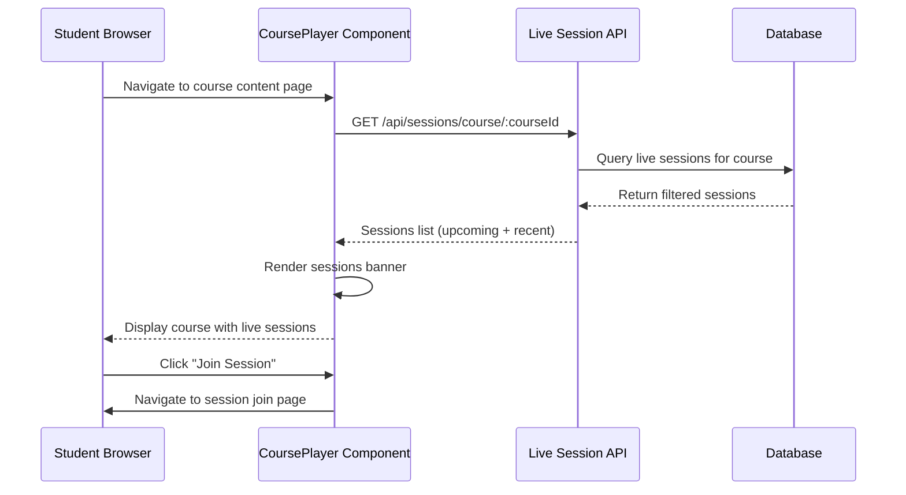

# Design Document: Course Live Sessions Display

## Overview

This feature displays recently scheduled live sessions at the top of the course content page (CoursePlayer) for students. When a student views a course, they will see upcoming and recent live sessions specific to that course, helping them stay aware of scheduled classes. The display shows the next 3 upcoming sessions or sessions within the last 24 hours, sorted by start time.

## Main Algorithm/Workflow



## Core Interfaces/Types

```pascal
STRUCTURE LiveSessionSummary
  _id: String
  topic: String
  description: String
  startTime: DateTime
  duration: Number
  status: Enum('scheduled', 'live', 'ended')
  instructor: InstructorInfo
  zoom: ZoomInfo
  enrolledStudents: Array<String>
END STRUCTURE

STRUCTURE InstructorInfo
  _id: String
  name: String
  profileImage: String
END STRUCTURE

STRUCTURE ZoomInfo
  meetingId: String
  joinUrl: String
  passcode: String
END STRUCTURE

STRUCTURE SessionDisplayProps
  courseId: String
  sessions: Array<LiveSessionSummary>
  onJoinSession: Function
END STRUCTURE
```

## Key Functions with Formal Specifications

### Function 1: fetchCourseLiveSessions()

```pascal
FUNCTION fetchCourseLiveSessions(courseId)
  INPUT: courseId of type String
  OUTPUT: sessions of type Array<LiveSessionSummary>
```

**Preconditions:**
- `courseId` is a valid 24-character MongoDB ObjectId
- User is authenticated and enrolled in the course
- API endpoint `/api/sessions/course/:courseId` is available

**Postconditions:**
- Returns array of live sessions for the specified course
- Sessions are filtered to show only upcoming or recent (within 24 hours)
- Sessions are sorted by startTime in ascending order
- Maximum of 3 sessions are returned
- If no sessions exist, returns empty array

**Loop Invariants:** N/A (API call, no loops)

### Function 2: filterRecentSessions()

```pascal
FUNCTION filterRecentSessions(sessions)
  INPUT: sessions of type Array<LiveSessionSummary>
  OUTPUT: filtered of type Array<LiveSessionSummary>
```

**Preconditions:**
- `sessions` is a valid array (may be empty)
- Each session has a valid `startTime` field
- Each session has a valid `status` field

**Postconditions:**
- Returns sessions where status is 'scheduled' or 'live'
- OR sessions where status is 'ended' and endTime is within last 24 hours
- Sessions are sorted by startTime ascending
- Maximum 3 sessions returned
- No side effects on input array

**Loop Invariants:**
- For filtering loop: All previously processed sessions meet the time/status criteria
- Session order is maintained during filtering

### Function 3: renderSessionBanner()

```pascal
FUNCTION renderSessionBanner(session)
  INPUT: session of type LiveSessionSummary
  OUTPUT: JSX element representing the session banner
```

**Preconditions:**
- `session` is a valid LiveSessionSummary object
- `session.topic` is non-empty string
- `session.startTime` is valid DateTime
- `session.status` is one of: 'scheduled', 'live', 'ended'

**Postconditions:**
- Returns valid React JSX element
- Banner displays session topic, instructor, start time, and status
- Join button is enabled only if status is 'scheduled' or 'live'
- Visual styling reflects session status (live = red, scheduled = blue, ended = gray)
- No mutations to input session object

**Loop Invariants:** N/A (rendering function, no loops)

## Algorithmic Pseudocode

### Main Component Initialization Algorithm

```pascal
ALGORITHM initializeCoursePlayerWithSessions(courseId)
INPUT: courseId of type String
OUTPUT: Component state initialized with course data and live sessions

BEGIN
  ASSERT courseId IS NOT NULL AND LENGTH(courseId) = 24
  
  // Step 1: Initialize state
  state ← {
    course: NULL,
    liveSessions: [],
    loading: TRUE,
    error: NULL
  }
  
  // Step 2: Fetch course data and live sessions in parallel
  PARALLEL BEGIN
    courseData ← fetchCourseData(courseId)
    sessionsData ← fetchCourseLiveSessions(courseId)
  END PARALLEL
  
  // Step 3: Filter and sort sessions
  recentSessions ← filterRecentSessions(sessionsData)
  
  // Step 4: Update state
  state.course ← courseData
  state.liveSessions ← recentSessions
  state.loading ← FALSE
  
  ASSERT state.course IS NOT NULL
  ASSERT state.liveSessions IS ARRAY
  
  RETURN state
END
```

**Preconditions:**
- courseId is valid MongoDB ObjectId
- User is authenticated
- Network connection is available

**Postconditions:**
- Component state contains course data
- Component state contains filtered live sessions (max 3)
- Loading state is set to FALSE
- Error state is NULL if successful

**Loop Invariants:** N/A (parallel operations, no explicit loops)

### Session Filtering Algorithm

```pascal
ALGORITHM filterRecentSessions(sessions)
INPUT: sessions of type Array<LiveSessionSummary>
OUTPUT: filtered of type Array<LiveSessionSummary>

BEGIN
  IF sessions IS NULL OR LENGTH(sessions) = 0 THEN
    RETURN []
  END IF
  
  currentTime ← getCurrentDateTime()
  twentyFourHoursAgo ← currentTime - 24 HOURS
  filtered ← []
  
  // Filter sessions based on status and time
  FOR each session IN sessions DO
    ASSERT session.startTime IS VALID_DATETIME
    ASSERT session.status IN ['scheduled', 'live', 'ended', 'cancelled']
    
    IF session.status = 'scheduled' OR session.status = 'live' THEN
      filtered.ADD(session)
    ELSE IF session.status = 'ended' AND session.endTime >= twentyFourHoursAgo THEN
      filtered.ADD(session)
    END IF
  END FOR
  
  // Sort by start time ascending
  filtered ← SORT(filtered, BY startTime ASCENDING)
  
  // Limit to 3 sessions
  IF LENGTH(filtered) > 3 THEN
    filtered ← filtered[0..2]
  END IF
  
  ASSERT LENGTH(filtered) <= 3
  ASSERT ALL sessions IN filtered MEET time/status criteria
  
  RETURN filtered
END
```

**Preconditions:**
- sessions is an array (may be empty)
- Each session has startTime, status, and endTime fields
- getCurrentDateTime() returns current server time

**Postconditions:**
- Returns array with maximum 3 sessions
- All returned sessions are either upcoming, live, or recently ended
- Sessions are sorted by startTime ascending
- Original sessions array is not mutated

**Loop Invariants:**
- All sessions added to filtered array meet the time/status criteria
- Session order is maintained during iteration

### Join Session Handler Algorithm

```pascal
ALGORITHM handleJoinSession(sessionId, sessionStatus)
INPUT: sessionId of type String, sessionStatus of type String
OUTPUT: Navigation to appropriate session page

BEGIN
  ASSERT sessionId IS NOT NULL
  ASSERT sessionStatus IN ['scheduled', 'live', 'ended']
  
  IF sessionStatus = 'live' THEN
    // Navigate to live session room
    NAVIGATE_TO('/student/session/' + sessionId + '/join')
  ELSE IF sessionStatus = 'scheduled' THEN
    // Show session details with countdown
    NAVIGATE_TO('/student/session/' + sessionId + '/details')
  ELSE
    // Session ended - show error or recording
    SHOW_MESSAGE('This session has ended. Check for recordings.')
  END IF
  
  ASSERT navigation occurred OR message displayed
END
```

**Preconditions:**
- sessionId is valid MongoDB ObjectId
- sessionStatus is one of the valid enum values
- User is enrolled in the session
- Navigation function is available

**Postconditions:**
- User is navigated to appropriate page based on session status
- OR user sees appropriate message if session is not joinable
- No state mutations occur

**Loop Invariants:** N/A (conditional navigation, no loops)

## Example Usage

```pascal
SEQUENCE
  // 1. Student navigates to course content page
  courseId ← "507f1f77bcf86cd799439011"
  
  // 2. Component initializes and fetches data
  state ← initializeCoursePlayerWithSessions(courseId)
  
  // 3. Display live sessions banner if sessions exist
  IF LENGTH(state.liveSessions) > 0 THEN
    FOR each session IN state.liveSessions DO
      banner ← renderSessionBanner(session)
      DISPLAY banner AT TOP_OF_PAGE
    END FOR
  END IF
  
  // 4. Student clicks "Join Session" button
  selectedSession ← state.liveSessions[0]
  handleJoinSession(selectedSession._id, selectedSession.status)
  
  // 5. Student is navigated to session room
  // (Navigation handled by routing system)
END SEQUENCE
```

## Correctness Properties

### Property 1: Session Count Limit
```pascal
PROPERTY SessionCountLimit
  FORALL courseId IN ValidCourseIds:
    sessions ← fetchCourseLiveSessions(courseId)
    ASSERT LENGTH(sessions) <= 3
END PROPERTY
```

### Property 2: Session Time Relevance
```pascal
PROPERTY SessionTimeRelevance
  FORALL session IN displayedSessions:
    currentTime ← getCurrentDateTime()
    ASSERT (
      session.status = 'scheduled' AND session.startTime >= currentTime
    ) OR (
      session.status = 'live'
    ) OR (
      session.status = 'ended' AND session.endTime >= (currentTime - 24_HOURS)
    )
END PROPERTY
```

### Property 3: Session Ordering
```pascal
PROPERTY SessionOrdering
  FORALL i, j IN displayedSessions WHERE i < j:
    ASSERT displayedSessions[i].startTime <= displayedSessions[j].startTime
END PROPERTY
```

### Property 4: Course Association
```pascal
PROPERTY CourseAssociation
  FORALL session IN displayedSessions:
    ASSERT session.course = currentCourseId
END PROPERTY
```

### Property 5: Student Enrollment
```pascal
PROPERTY StudentEnrollment
  FORALL session IN displayedSessions:
    ASSERT currentStudentId IN session.enrolledStudents
      OR session.course IS NULL  // University-wide session
END PROPERTY
```
