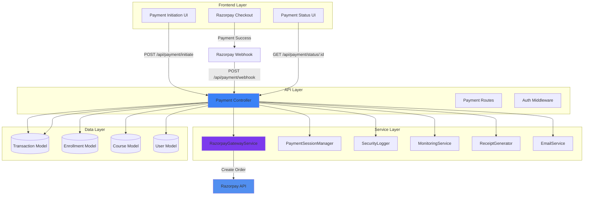

# Design Document: Razorpay Payment Migration

## Overview

This design document outlines the complete migration of the SKILLDAD payment system from Stripe to Razorpay. The migration involves removing all Stripe dependencies and implementing a full Razorpay integration while maintaining all existing payment functionality. The system will support INR currency with multiple payment methods (UPI, Cards, Netbanking, Wallets) and ensure secure backend validation with automatic course unlocking after successful payments.

The migration follows a modular architecture pattern, replacing the existing `StripeGatewayService` with a new `RazorpayGatewayService` while preserving the payment controller orchestration layer and transaction management system. This approach ensures minimal disruption to other application features while providing a production-ready payment solution with comprehensive error handling, logging, and testing.

## Architecture

The payment system follows a layered architecture with clear separation of concerns:



## Sequence Diagrams

### Payment Initiation Flow

```mermaid
sequenceDiagram
    participant U as User/Frontend
    participant PC as PaymentController
    participant RGS as RazorpayGatewayService
    participant RA as Razorpay API
    participant DB as Database
    participant PSM as PaymentSessionManager
    
    U->>PC: POST /api/payment/initiate
    PC->>DB: Validate Course & User
    DB-->>PC: Course & User Data
    PC->>PC: Calculate Amounts (GST, Discount)
    PC->>PSM: Create Payment Session
    PSM-->>PC: Session ID & Expiry
    PC->>DB: Create Transaction (status: pending)
    DB-->>PC: Transaction Created
    PC->>RGS: createOrder(transactionData)
    RGS->>RA: POST /orders
    RA-->>RGS: Order ID & Details
    RGS-->>PC: Order Response
    PC-->>U: Order ID, Key, Amount
    U->>U: Initialize Razorpay Checkout
    U->>RA: User Completes Payment
    RA-->>U: Payment Success/Failure
